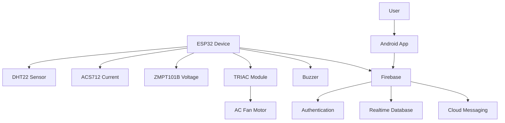

# 🌪️ SmartFan: IoT Stand Fan Automation & Android App

<div align="center">


**🔥 Complete IoT solution for intelligent fan automation with real-time monitoring**

[📱 Features](#-features) • [⚡ Quick Start](#-quick-start) • [🛠️ Installation](#️-installation) • [📖 Documentation](#-documentation)

</div>

---

## 🎯 Overview

**SmartFan** is a comprehensive IoT ecosystem that transforms any standard stand fan into an intelligent, automated climate control system. Built with ESP32 microcontroller and a modern Android companion app, it delivers seamless temperature-based automation, real-time monitoring, and cloud integration.

### 🔥 Key Highlights

- **🤖 Intelligent Automation**: PID-based temperature control with customizable thresholds
- **📊 Real-time Monitoring**: Live temperature, humidity, voltage, current, and power consumption tracking
- **📱 Modern Android App**: Material Design 3 with animated gauges and intuitive controls
- **☁️ Cloud Integration**: Firebase backend for data logging, user authentication, and remote control
- **🔧 Easy Setup**: WiFiManager integration with captive portal configuration
- **⚡ Power Monitoring**: Comprehensive electrical monitoring with safety alerts
- **🔔 Smart Notifications**: Push notifications for temperature alerts and system status

---

## 📋 Recent Updates (September 2025)

### 🔧 TRIACModule PWM Integration
- ✨ **New Hardware Control**: Added `TRIACModule.h` and `TRIACModule.cpp` for precision PWM-based TRIAC control
- 🎯 **Phase Angle Control**: Software-based phase angle control for universal motor fans
- 🧩 **Modular Architecture**: Fully integrated into `SmartFan.ino` with testable, maintainable design
- 📈 **Performance Testing**: Validated power sweep from 0% to 100% with interrupt-driven timing
- 🔄 **RobotDyn Compatibility**: Adapted RobotDyn Dimmer library for ESP32 and modular C++

### 📶 WiFi Management Enhancements
- 🌐 **WiFiManager Integration**: Dynamic WiFi configuration using captive portal
- 📱 **Android WiFi Setup**: Configure device WiFi directly through the companion app
- 🔄 **WiFi Reset Capability**: Hardware button reset for WiFi settings
- 🚪 **Captive Portal**: Easy first-time device configuration at 192.168.4.1

### ⚡ Power Monitoring System
- 📊 **Comprehensive Monitoring**: Real-time voltage, current, power, and energy consumption tracking
- 🚨 **Safety Alerts**: Automatic notifications for high power consumption
- 📈 **Energy Analytics**: kWh tracking with historical data logging
- 🎨 **Enhanced UI**: Color-coded status indicators and responsive Material Design cards

---

## 🚀 Features

### 🤖 ESP32 Firmware Capabilities

<details>
<summary><b>🌡️ Intelligent Climate Control</b></summary>

- **🎯 PID-Based Control**: Advanced temperature-based fan speed automation
- **🔧 TRIAC Phase Control**: Precision PWM/phase angle control for universal motors
- **📊 Environmental Monitoring**: DHT22 sensor for temperature and humidity tracking
- **⚙️ Configurable Setpoints**: Customizable temperature thresholds and PID parameters
- **🎵 Audio Alerts**: Buzzer notifications for over-temperature conditions

</details>

<details>
<summary><b>⚡ Power Monitoring & Safety</b></summary>

- **🔌 Electrical Monitoring**: ACS712 (current) and ZMPT101B (voltage) sensors
- **📈 Power Analytics**: Real-time wattage calculation and kWh energy tracking
- **🛡️ Safety Features**: Automatic alerts for high power consumption
- **🔍 RMS Calculation**: True RMS measurement with sensor calibration
- **📋 Data Logging**: Comprehensive power usage history

</details>

<details>
<summary><b>🌐 Connectivity & Configuration</b></summary>

- **📶 WiFiManager Integration**: User-friendly captive portal setup (192.168.4.1)
- **☁️ Firebase Sync**: Real-time cloud data logging and remote control
- **🔄 Auto-Reconnection**: Robust WiFi connection management
- **🔧 Hardware Reset**: Physical button WiFi reset capability
- **📡 Access Point Mode**: Automatic fallback for configuration

</details>

<details>
<summary><b>🏗️ Architecture & Development</b></summary>

- **🧩 Modular Design**: Each component encapsulated in dedicated C++ classes
- **🔧 Maintainable Code**: Clean separation of concerns for easy extension
- **📝 Serial Debugging**: Comprehensive logging for development and troubleshooting
- **⚡ Non-blocking Operations**: Efficient multitasking without interference
- **🎛️ Pin Configuration**: Centralized pin management through `PinConfig.h`

</details>

### 📱 Android App Features

<details>
<summary><b>🔐 User Management & Security</b></summary>

- **🔑 Firebase Authentication**: Secure email/password login and registration
- **🔗 Device Linking**: Secure device association with user accounts
- **🛡️ Access Control**: Firebase security rules for data protection
- **✅ Input Validation**: Comprehensive validation throughout the app
- **👤 Account Management**: Profile management and secure logout

</details>

<details>
<summary><b>📊 Real-time Dashboard</b></summary>

- **🌡️ Animated Temperature Gauge**: Beautiful SpeedView visualization
- **⚡ Power Monitoring Cards**: Live voltage, current, wattage, and energy display
- **🎛️ Fan Control Interface**: Manual speed control and auto/manual mode toggle
- **📈 Status Indicators**: Color-coded power consumption status chips
- **🔔 Live Alerts**: Real-time notifications for temperature and power thresholds

</details>

<details>
<summary><b>🛠️ Device Management & Setup</b></summary>

- **📶 WiFi Configuration**: Scan networks and configure device WiFi through app
- **🔧 Device Setup Wizard**: Step-by-step device linking and configuration
- **🏷️ Device Naming**: Rename and organize multiple devices
- **🔄 Connection Management**: Monitor device connectivity and status
- **📋 Device History**: Access to device configuration and setup logs

</details>

<details>
<summary><b>📈 Analytics & History</b></summary>

- **📊 Historical Data**: View temperature, fan speed, and power consumption logs
- **⏰ Timestamp Tracking**: Detailed historical data with proper time formatting
- **💾 Data Export**: Access to last 50 log entries with filtering capabilities
- **📱 Enhanced Log View**: Custom RecyclerView with structured data display
- **🎯 Conditional Display**: Backward compatibility with older data formats

</details>

<details>
<summary><b>🎨 User Experience & Design</b></summary>

- **🌙 Theme Support**: Light and dark mode with consistent Material Design 3
- **📱 Responsive Design**: Adaptive layouts for different screen sizes
- **✨ Smooth Animations**: Card animations and transition effects
- **🎯 Intuitive Navigation**: User-friendly interface with clear visual hierarchy
- **🔔 Push Notifications**: Firebase Cloud Messaging for real-time alerts

</details>

### 🌐 System Integration

<details>
<summary><b>☁️ Firebase Backend Services</b></summary>

- **🔑 Authentication**: Secure user management with email/password
- **📊 Realtime Database**: Live data synchronization between device and app
- **🔔 Cloud Messaging**: Push notifications for alerts and status updates
- **🛡️ Security Rules**: Role-based access control and data protection
- **📈 Analytics**: Usage tracking and performance monitoring

</details>

---

## ⚡ Quick Start

### 🔧 Hardware Setup

**Required Components:**
- 🧠 **ESP32 Microcontroller**
- 🌡️ **DHT22 Temperature/Humidity Sensor**
- ⚡ **ACS712 Current Sensor** (5A, pin 34)
- 🔌 **ZMPT101B Voltage Sensor** (pin 35)
- 🔊 **Piezo Buzzer** (pin 25)
- 🎛️ **AC Light Dimming Module** (TRIAC, 8A-400V, 3.3V logic)
- 🔋 **Power Supply** (ESP32 compatible)

### 📊 Power Specifications
- **🔌 Voltage Range**: 110V-400V AC
- **⚡ Current Capacity**: Up to 8A load
- **🛡️ Protection**: Automatic overload cutoff
- **📏 Module Size**: ~5.7x2.85cm (2.24x1.12in)
- **🧠 Logic Level**: 3.3V/5V compatible

---

## 🛠️ Installation

### 🔧 ESP32 Firmware Setup

<details>
<summary><b>📚 Required Libraries</b></summary>

Install these libraries in Arduino IDE:

```bash
# Core Libraries
- Firebase ESP-Client by Mobizt
- WiFiManager by tzapu (v0.16.0+)
- PID_v1 Library
- ArduinoJson by Benoit Blanchon (v6.21.3+)
```

**Installation Steps:**
1. Open Arduino IDE
2. Go to **Sketch > Include Library > Manage Libraries**
3. Search and install each library listed above
4. Restart Arduino IDE

</details>

<details>
<summary><b>⚙️ Firmware Configuration</b></summary>

1. **📥 Clone Repository**:
   ```bash
   git clone https://github.com/qppd/IoT-Smart-Fan.git
   cd IoT-Smart-Fan
   ```

2. **🔧 Configure Credentials**:
   - Edit `source/esp/SmartFan/firebase_credentials.h`
   - Set your Firebase project credentials
   - Configure WiFi fallback credentials (optional)

3. **📤 Upload Firmware**:
   - Connect ESP32 to computer
   - Select correct board and port in Arduino IDE
   - Upload `source/esp/SmartFan/SmartFan.ino`

</details>

### 📱 Android App Setup

<details>
<summary><b>🔨 Build Configuration</b></summary>

1. **📁 Open Project**:
   ```bash
   # Open in Android Studio
   source/android/SmartFan/
   ```

2. **🔥 Firebase Setup**:
   - Download `google-services.json` from Firebase Console
   - Place in `app/` directory
   - Ensure package name matches your Firebase project

3. **🏗️ Build & Install**:
   - Build project in Android Studio
   - Install on Android device (API 21+)
   - Grant required permissions

</details>

---

## 📡 WiFi Configuration

### 🌐 First-Time Setup

<details>
<summary><b>🔧 ESP32 Configuration Process</b></summary>

1. **📶 Access Point Mode**:
   - ESP32 creates network: `SmartFan-[ChipID]`
   - Password: `smartfan123`
   - Captive portal automatically opens

2. **🌐 Network Configuration**:
   - Connect device to ESP32 network
   - Navigate to: `192.168.4.1`
   - Enter WiFi credentials and device settings
   - ESP32 saves configuration and connects

3. **🔄 Reset Capability**:
   - Hold BOOT button (GPIO 0) for 5 seconds
   - ESP32 beeps and enters setup mode
   - Reconfigure WiFi as needed

</details>

### 📱 Android WiFi Setup

<details>
<summary><b>🛠️ App-Based Configuration</b></summary>

1. **📶 Network Scanning**:
   - App scans for available WiFi networks
   - Automatically detects SmartFan access points
   - Material Design interface for network selection

2. **🔧 Configuration Transfer**:
   - Select target WiFi network
   - Enter credentials and optional device ID
   - App connects to SmartFan AP and transfers config

3. **✅ Completion**:
   - ESP32 receives configuration
   - Automatically connects to home WiFi
   - Ready for device linking in app

</details>

---

## 📖 Documentation

### 🏗️ System Architecture



### 📊 Database Structure

<details>
<summary><b>🔥 Firebase Realtime Database Schema</b></summary>

```json
{
  "users": {
    "uid123": {
      "email": "user@email.com",
      "devices": {
        "deviceIdABC": true
      },
      "settings": {
        "theme": "dark",
        "tempMin": 25,
        "tempMax": 30
      },
      "fcmToken": "firebase_messaging_token"
    }
  },
  "devices": {
    "deviceIdABC": {
      "owner": "uid123",
      "name": "Living Room Fan",
      "current": {
        "temperature": 28.5,
        "humidity": 65.0,
        "fanSpeed": 2,
        "mode": "auto",
        "voltage": 220.1,
        "current": 0.150,
        "watt": 33.02,
        "kwh": 0.125,
        "lastUpdate": 1692620000
      },
      "logs": {
        "timestamp_1692620000": {
          "timestamp": 1692620000,
          "temperature": 28.5,
          "fanSpeed": 2,
          "voltage": 220.1,
          "current": 0.150,
          "watt": 33.02,
          "kwh": 0.125
        }
      }
    }
  }
}
```

</details>

### 📁 Project Structure

<details>
<summary><b>📂 Directory Organization</b></summary>

```
SmartFan/
├── 📊 diagram/                     # Circuit diagrams and schematics
│   ├── SmartFan.fzz              # Fritzing project file
│   └── SmartFan.png              # Circuit diagram image
├── 🔮 model/                      # Reserved for future ML models
└── 💻 source/
    ├── 📱 android/SmartFan/       # Android application
    │   ├── 📱 app/
    │   │   ├── 🔑 src/main/java/com/qppd/smartfan/
    │   │   │   ├── auth/          # Authentication activities
    │   │   │   ├── device/        # Device management
    │   │   │   ├── ui/            # Main UI components
    │   │   │   └── utils/         # Utilities and helpers
    │   │   ├── 🎨 src/main/res/   # Resources (layouts, drawables)
    │   │   └── 🔥 google-services.json
    │   └── 🏗️ build.gradle
    └── 🧠 esp/SmartFan/           # ESP32 firmware
        ├── SmartFan.ino           # Main application logic
        ├── 🌡️ DHTSensor.cpp/.h    # Temperature/humidity sensor
        ├── ⚡ CURRENTSensor.cpp/.h # Current measurement
        ├── 🔌 VOLTAGESensor.cpp/.h # Voltage measurement
        ├── 🎛️ TRIACModule.cpp/.h   # TRIAC control
        ├── 🎯 PIDConfig.cpp/.h     # PID control logic
        ├── 🔊 BUZZERConfig.cpp/.h  # Buzzer alerts
        ├── 🔥 FirebaseConfig.cpp/.h # Cloud integration
        ├── 📡 firebase_credentials.h # Credentials
        └── 📌 PinConfig.h          # Pin assignments
```

</details>

---

## 🔧 Advanced Configuration

### ⚙️ ESP32 Firmware Configuration

<details>
<summary><b>🎯 PID Controller Tuning</b></summary>

**Default PID Parameters:**
```cpp
// In PIDConfig.h
#define DEFAULT_KP 2.0    // Proportional gain
#define DEFAULT_KI 0.1    // Integral gain  
#define DEFAULT_KD 0.05   // Derivative gain
#define SETPOINT 26.0     // Target temperature (°C)
```

**Tuning Guidelines:**
- **Kp**: Increase for faster response, decrease if oscillating
- **Ki**: Increase to eliminate steady-state error
- **Kd**: Increase to reduce overshoot and oscillation

</details>

<details>
<summary><b>⚡ Power Monitoring Calibration</b></summary>

**Current Sensor (ACS712):**
```cpp
// In CURRENTSensor.cpp
#define ACS_SENSITIVITY 0.185  // 5A module: 185mV/A
#define ACS_OFFSET 2.5         // Zero current voltage
```

**Voltage Sensor (ZMPT101B):**
```cpp
// In VOLTAGESensor.cpp
#define VOLTAGE_CALIBRATION 1.0  // Adjust based on actual readings
#define VOLTAGE_OFFSET 0.0       // DC offset compensation
```

</details>

### 📱 Android App Customization

<details>
<summary><b>🎨 Theme Configuration</b></summary>

**Color Schemes:**
```xml
<!-- In colors.xml -->
<color name="primary">#1976D2</color>
<color name="accent">#FF5722</color>
<color name="temperature_normal">#4CAF50</color>
<color name="temperature_high">#FF9800</color>
<color name="temperature_critical">#F44336</color>
```

**Material Design 3 Components:**
- Dynamic color theming support
- Adaptive layouts for different screen sizes
- Consistent typography and spacing

</details>

---

## 🚨 Alert System

### 📊 Power Consumption Alerts

<details>
<summary><b>⚡ Alert Thresholds</b></summary>

| Status | Power Range | Color | Action |
|--------|-------------|-------|---------|
| 🟢 Low | < 10W | Green | Normal operation |
| 🔵 Normal | 10-50W | Blue | Standard monitoring |
| 🟡 High | 50-100W | Yellow | Caution alert |
| 🔴 Critical | ≥ 100W | Red | Immediate notification |

</details>

### 🌡️ Temperature Monitoring

<details>
<summary><b>🔥 Temperature Alerts</b></summary>

- **📈 Over-temperature**: Buzzer activation at setpoint + 2°C
- **📱 Push Notifications**: Real-time alerts via Firebase FCM
- **⏰ Alert Duration**: 300ms buzzer beep (configurable)
- **🔄 Reset Conditions**: Automatic reset when temperature normalizes

</details>

---

## 🧪 Testing & Validation

### ✅ Hardware Testing

<details>
<summary><b>🔧 Component Validation</b></summary>

**Sensor Testing:**
```bash
# Serial Monitor Output
Temperature: 26.5°C | Humidity: 60%
Voltage: 220.1V | Current: 0.150A
Power: 33.02W | Energy: 0.125kWh
Fan Speed: 65% | Mode: AUTO
```

**TRIAC Testing:**
- Power sweep validation (0-100%)
- Zero-cross detection timing
- Phase angle accuracy verification

</details>

### 📱 App Testing Scenarios

<details>
<summary><b>🧪 Test Cases</b></summary>

1. **✅ Authentication Flow**: Login/register/logout validation
2. **✅ Device Linking**: QR code and manual ID entry testing
3. **✅ Real-time Updates**: Live data synchronization validation
4. **✅ WiFi Configuration**: Captive portal and app-based setup
5. **✅ Power Monitoring**: Threshold alerts and display accuracy
6. **✅ Theme Switching**: Light/dark mode consistency
7. **✅ Offline Handling**: Graceful degradation without connectivity

</details>

---

## 🔒 Security Considerations

### 🛡️ Firebase Security Rules

<details>
<summary><b>🔐 Access Control Rules</b></summary>

```javascript
{
  "rules": {
    "users": {
      "$uid": {
        ".read": "$uid === auth.uid",
        ".write": "$uid === auth.uid"
      }
    },
    "devices": {
      "$deviceId": {
        ".read": "root.child('devices').child($deviceId).child('owner').val() === auth.uid",
        ".write": "root.child('devices').child($deviceId).child('owner').val() === auth.uid"
      }
    }
  }
}
```

</details>

### 🔧 Device Security

<details>
<summary><b>🛡️ Security Features</b></summary>

- **🔐 WPA2 Protection**: SmartFan AP uses secure password
- **⏱️ Timeout Protection**: Configuration portal auto-closes after inactivity
- **🔄 Reset Protection**: Physical button required for WiFi reset
- **📡 Limited Access**: Configuration only available in setup mode

</details>

---

## 🚀 Future Enhancements

### 🔮 Planned Features

<details>
<summary><b>📈 Next Version Roadmap</b></summary>

**🤖 Smart Features:**
- 🧠 Machine learning temperature prediction
- 📊 Advanced analytics and usage patterns
- 🌤️ Weather integration for predictive control
- 📅 Scheduling and automation rules

**📱 App Enhancements:**
- 📈 Interactive charts and data visualization
- 🔔 Customizable notification preferences
- 🏠 Multi-room and multi-device management
- 🎯 Geofencing for automatic control

**🔧 Hardware Improvements:**
- 📶 Bluetooth fallback configuration
- 🔋 Battery backup for settings retention
- 📡 Mesh networking for multiple devices
- 🌡️ Additional sensor types support

</details>

---

## 🤝 Contributing

We welcome contributions from the community! Here's how you can help:

### 🛠️ Development Setup

<details>
<summary><b>🔧 Setup Instructions</b></summary>

1. **📥 Fork and Clone**:
   ```bash
   git clone https://github.com/your-username/IoT-Smart-Fan.git
   cd IoT-Smart-Fan
   ```

2. **🌿 Create Feature Branch**:
   ```bash
   git checkout -b feature/your-feature-name
   ```

3. **💻 Development Environment**:
   - ESP32: Arduino IDE or PlatformIO
   - Android: Android Studio (latest version)
   - Firebase: Firebase Console access

4. **✅ Testing**:
   - Test hardware changes with actual components
   - Validate app changes on multiple devices
   - Ensure backward compatibility

</details>

### 📋 Contribution Guidelines

- 🐛 **Bug Reports**: Use issue templates with detailed descriptions
- ✨ **Feature Requests**: Discuss new features in issues before implementing
- 📝 **Documentation**: Update README and code comments
- 🧪 **Testing**: Include tests for new functionality
- 🎨 **Code Style**: Follow existing conventions and formatting

---

## 📄 License

<div align="center">

**📱 Android App**: Apache 2.0 License  
**🧠 ESP32 Firmware**: MIT License

See the `LICENSE` file for complete details.

</div>

---

## 👨‍💻 Author

<div align="center">

**Created with ❤️ by [qppd](https://github.com/qppd)**

[](https://github.com/qppd)
[](https://github.com/qppd/IoT-Smart-Fan)

*Transforming everyday appliances into intelligent IoT solutions*

</div>

---

<div align="center">

### 🌟 Star this project if you find it useful!


**[⬆ Back to Top](#-smartfan-iot-stand-fan-automation--android-app)**

</div>