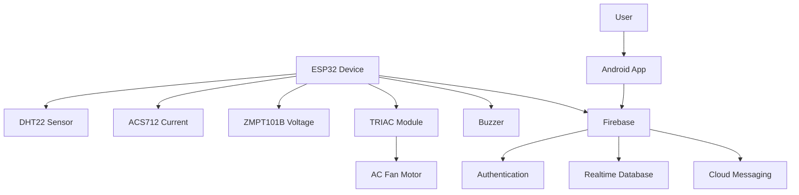

# 🌪️ SmartFan: IoT Stand Fan Automation & Android App

<div align="center">


**🔥 Complete IoT solution for intelligent fan automation with real-time monitoring**

[📱 Features](#-features) • [⚡ Quick Start](#-quick-start) • [🛠️ Installation](#️-installation) • [📖 Documentation](#-documentation)

</div>

---

## 🎯 Overview

**SmartFan** is a comprehensive IoT ecosystem that transforms any standard stand fan into an intelligent, automated climate control system. Built with a **dual-ESP architecture** featuring ESP8266 and ESP32 microcontrollers working in tandem, plus a modern Android companion app, it delivers seamless temperature-based automation, real-time monitoring, and cloud integration.

### 🏗️ Dual-ESP Architecture

- **🌐 ESP8266**: WiFi Manager + Firebase Handler - Manages wireless connectivity, cloud database operations, and mobile app notifications
- **🧠 ESP32**: Sensor Reader + Hardware Controller - Handles all sensors (DHT22, ACS712, ZMPT101B), TRIAC fan control, and hardware safety monitoring
- **📡 Serial Communication**: Custom protocol for real-time data exchange between microcontrollers at 9600 baud

### 🔥 Key Highlights

- **🤖 Intelligent Automation**: Temperature-based fan speed control with automatic/manual modes
- **📊 Real-time Monitoring**: Live temperature, humidity, voltage, current, and power consumption tracking
- **🏗️ Dual-ESP Architecture**: ESP8266 (WiFi/Firebase) + ESP32 (Sensors/Hardware) for robust performance
- **📡 Inter-ESP Communication**: Custom serial protocol for seamless data exchange and command handling
- **📱 Modern Android App**: Material Design 3 with animated gauges and intuitive controls
- **☁️ Cloud Integration**: Firebase backend for data logging, user authentication, and remote control
- **🔧 Easy Setup**: WiFiManager integration with captive portal configuration
- **⚡ Power Monitoring**: Comprehensive electrical monitoring with safety alerts (ACS712 + ZMPT101B)
- **🔔 Smart Notifications**: Push notifications for temperature alerts and system status

---

## 📋 Recent Updates (September 2025)

### 🔧 TRIACModule PWM Integration
- ✨ **New Hardware Control**: Added `TRIACModule.h` and `TRIACModule.cpp` for precision PWM-based TRIAC control
- 🎯 **Phase Angle Control**: Software-based phase angle control for universal motor fans
- 🧩 **Modular Architecture**: Fully integrated into `SmartFan.ino` with testable, maintainable design
- 📈 **Performance Testing**: Validated power sweep from 0% to 100% with interrupt-driven timing
- 🔄 **RobotDyn Compatibility**: Adapted RobotDyn Dimmer library for ESP32 and modular C++

### 📶 WiFi Management Enhancements
- 🌐 **WiFiManager Integration**: Dynamic WiFi configuration using captive portal
- 📱 **Android WiFi Setup**: Configure device WiFi directly through the companion app
- 🔄 **WiFi Reset Capability**: Hardware button reset for WiFi settings
- 🚪 **Captive Portal**: Easy first-time device configuration at 192.168.4.1

### ⚡ Power Monitoring System
- 📊 **Comprehensive Monitoring**: Real-time voltage, current, power, and energy consumption tracking
- 🚨 **Safety Alerts**: Automatic notifications for high power consumption
- 📈 **Energy Analytics**: kWh tracking with historical data logging
- 🎨 **Enhanced UI**: Color-coded status indicators and responsive Material Design cards

---

## 📡 Dual-ESP Communication Architecture

### 🏗️ System Architecture Overview

The SmartFan system utilizes a specialized dual-ESP architecture where two microcontrollers work together via serial communication to provide robust, fault-tolerant operation:

**ESP8266 (WiFi & Firebase Module):**
- ✅ WiFi connection management with captive portal setup
- ✅ Firebase database operations and real-time synchronization  
- ✅ Mobile app push notifications via Firebase Cloud Messaging
- ✅ Data logging and analytics processing
- ✅ Remote control command handling from mobile app
- ✅ WiFi reset functionality (3-second hold button)

**ESP32 (Sensor & Hardware Module):**
- ✅ DHT22 temperature/humidity sensor monitoring
- ✅ ACS712 current sensor with calibrated RMS calculations
- ✅ ZMPT101B voltage sensor with true RMS measurement
- ✅ TRIAC fan speed control with phase angle modulation
- ✅ Piezo buzzer alerts for temperature thresholds
- ✅ Automatic temperature-based fan control logic
- ✅ Hardware safety monitoring and error detection

### 🔌 Hardware Communication Setup

**Serial Connection:**
- **Baud Rate**: 9600 bps for reliable communication
- **ESP8266 Side**: D6 (RX) ↔ D7 (TX) using SoftwareSerial
- **ESP32 Side**: GPIO16 (RX) ↔ GPIO17 (TX) using HardwareSerial2
- **Wiring**: ESP8266 TX (D7) → ESP32 RX (GPIO16), ESP8266 RX (D6) → ESP32 TX (GPIO17)
- **Power**: Both ESP boards require separate power supplies with common ground

### 📨 Communication Protocol

**Message Format:** `<TYPE:DATA>` with delimiters for reliable parsing

**ESP32 → ESP8266 (Sensor Data):**
```
<TEMP:25.5>     - Temperature reading (°C)
<HUMID:65.0>    - Humidity reading (%)  
<VOLT:220.0>    - Voltage reading (V)
<CURR:0.8>      - Current reading (A)
<FAN:75>        - Current fan speed (0-100%)
<BUZZ:ON>       - Buzzer status
<STATUS:RUNNING> - System operational status
<ALL:25.5,65.0,220.0,0.8,75> - Combined sensor data
```

**ESP8266 → ESP32 (Commands):**
```
<CMD:GET_SENSORS>     - Request fresh sensor readings
<CMD:GET_STATUS>      - System health check request
<SET_FAN:50>         - Set fan speed to 50%
<SET_TEMP:28.0>      - Set target temperature to 28°C
<FIREBASE:CONNECTED> - Firebase connection status
<WIFI:CONNECTED>     - WiFi connection status
<BUZZ:ALERT>         - Trigger emergency buzzer alert
```

### 🔄 Data Flow & Timing

**Normal Operation Cycle:**
1. **ESP32** reads all sensors every 2 seconds
2. **ESP32** sends combined sensor data to ESP8266 every 5 seconds  
3. **ESP8266** processes data and syncs to Firebase every 5 seconds
4. **ESP8266** sends status notifications every 30 seconds
5. **ESP8266** requests fresh data from ESP32 every 3 seconds

**Remote Command Flow:**
1. **Mobile App/Firebase** → **ESP8266** receives control commands
2. **ESP8266** → **ESP32** forwards hardware control commands
3. **ESP32** executes fan speed changes or alert triggers
4. **ESP32** → **ESP8266** confirms successful command execution
5. **ESP8266** → **Firebase** logs command execution for tracking

### 🛡️ Safety & Error Handling

**Communication Safeguards:**
- **Timeout Detection**: 1-second message timeout with retry logic
- **Connection Health**: Regular ping/pong communication tests
- **Fallback Mode**: ESP32 continues autonomous operation with last known settings
- **Error Alerts**: ESP8266 notifies Firebase of any communication issues

**Sensor Validation:**
- **Range Checking**: Validates sensor readings are within expected ranges
- **NaN Detection**: Filters out invalid/corrupted sensor readings
- **Error Reporting**: ESP32 sends error status messages to ESP8266
- **Safe Defaults**: System continues with safe fallback values during errors

---

## 🚀 Features

### � ESP32 Hardware Controller

<details>
<summary><b>🌡️ Intelligent Climate Control</b></summary>

- **🎯 Temperature-Based Control**: Automatic fan speed adjustment based on DHT22 temperature readings
- **🔧 TRIAC Phase Control**: Precision PWM/phase angle control for universal motor fans (0-100%)
- **📊 Environmental Monitoring**: DHT22 sensor for temperature and humidity tracking
- **⚙️ Configurable Setpoints**: Remote temperature target setting via ESP8266 commands
- **🎵 Audio Alerts**: Piezo buzzer notifications for over-temperature conditions (+3°C threshold)
- **🔄 Auto/Manual Modes**: Automatic temperature control or manual fan speed override

</details>

<details>
<summary><b>⚡ Power Monitoring & Safety</b></summary>

- **🔌 Electrical Monitoring**: ACS712 current sensor (0.185 V/A) and ZMPT101B voltage sensor
- **📈 Power Analytics**: Real-time wattage calculation (V×I) and kWh energy tracking
- **🛡️ Safety Features**: Sensor validation, range checking, and NaN detection
- **🔍 RMS Calculation**: True RMS measurement with calibrated sampling (100 samples)
- **📋 Error Handling**: Safe fallback values and error status reporting to ESP8266

</details>

<details>
<summary><b>📡 Inter-ESP Communication</b></summary>

- **� Serial Protocol**: Custom message format `<TYPE:DATA>` at 9600 baud
- **📤 Sensor Data**: Sends temperature, humidity, voltage, current, fan speed every 5 seconds
- **📥 Command Processing**: Receives fan speed and temperature setpoint commands
- **🔄 Health Monitoring**: Connection status and communication timeout handling
- **⏰ Timing Management**: 2-second sensor reads, 5-second data transmission

</details>

### 🌐 ESP8266 WiFi & Firebase Manager

<details>
<summary><b>🌐 Connectivity & Configuration</b></summary>

- **📶 WiFiManager Integration**: User-friendly captive portal setup (192.168.4.1)
- **☁️ Firebase Sync**: Real-time cloud data logging and remote control
- **🔄 Auto-Reconnection**: Robust WiFi connection management
- **🔧 Hardware Reset**: Physical button WiFi reset capability (3-second hold)
- **📡 Access Point Mode**: Automatic fallback for configuration

</details>

<details>
<summary><b>☁️ Cloud Integration & Notifications</b></summary>

- **🔥 Firebase Database**: Real-time device data updates and command handling
- **📱 Push Notifications**: Firebase Cloud Messaging for mobile app alerts
- **📊 Data Logging**: Historical sensor data storage and analytics
- **🎯 Remote Commands**: Processes fan speed and temperature commands from mobile app
- **⏰ Notification Scheduling**: Status updates every 30 seconds, data sync every 5 seconds

</details>

<details>
<summary><b>🏗️ Architecture & Development</b></summary>

- **🧩 Modular Design**: Each component encapsulated in dedicated C++ classes
- **🔧 Maintainable Code**: Clean separation of concerns for easy extension
- **📝 Serial Debugging**: Comprehensive logging for development and troubleshooting
- **⚡ Non-blocking Operations**: Efficient multitasking without interference
- **🎛️ Pin Configuration**: Centralized pin management through `PinConfig.h`

</details>

### 📱 Android App Features

<details>
<summary><b>🔐 User Management & Security</b></summary>

- **🔑 Firebase Authentication**: Secure email/password login and registration
- **🔗 Device Linking**: Secure device association with user accounts
- **🛡️ Access Control**: Firebase security rules for data protection
- **✅ Input Validation**: Comprehensive validation throughout the app
- **👤 Account Management**: Profile management and secure logout

</details>

<details>
<summary><b>📊 Real-time Dashboard</b></summary>

- **🌡️ Animated Temperature Gauge**: Beautiful SpeedView visualization
- **⚡ Power Monitoring Cards**: Live voltage, current, wattage, and energy display
- **🎛️ Fan Control Interface**: Manual speed control and auto/manual mode toggle
- **📈 Status Indicators**: Color-coded power consumption status chips
- **🔔 Live Alerts**: Real-time notifications for temperature and power thresholds

</details>

<details>
<summary><b>🛠️ Device Management & Setup</b></summary>

- **📶 WiFi Configuration**: Scan networks and configure device WiFi through app
- **🔧 Device Setup Wizard**: Step-by-step device linking and configuration
- **🏷️ Device Naming**: Rename and organize multiple devices
- **🔄 Connection Management**: Monitor device connectivity and status
- **📋 Device History**: Access to device configuration and setup logs

</details>

<details>
<summary><b>📈 Analytics & History</b></summary>

- **📊 Historical Data**: View temperature, fan speed, and power consumption logs
- **⏰ Timestamp Tracking**: Detailed historical data with proper time formatting
- **💾 Data Export**: Access to last 50 log entries with filtering capabilities
- **📱 Enhanced Log View**: Custom RecyclerView with structured data display
- **🎯 Conditional Display**: Backward compatibility with older data formats

</details>

<details>
<summary><b>🎨 User Experience & Design</b></summary>

- **🌙 Theme Support**: Light and dark mode with consistent Material Design 3
- **📱 Responsive Design**: Adaptive layouts for different screen sizes
- **✨ Smooth Animations**: Card animations and transition effects
- **🎯 Intuitive Navigation**: User-friendly interface with clear visual hierarchy
- **🔔 Push Notifications**: Firebase Cloud Messaging for real-time alerts

</details>

### 🌐 System Integration

<details>
<summary><b>☁️ Firebase Backend Services</b></summary>

- **🔑 Authentication**: Secure user management with email/password
- **📊 Realtime Database**: Live data synchronization between device and app
- **🔔 Cloud Messaging**: Push notifications for alerts and status updates
- **🛡️ Security Rules**: Role-based access control and data protection
- **📈 Analytics**: Usage tracking and performance monitoring

</details>

---

## ⚡ Quick Start

### 🔧 Hardware Setup

**Required Microcontrollers:**
- 🌐 **ESP8266 Microcontroller** (WiFi & Firebase Handler)
- 🧠 **ESP32 Microcontroller** (Sensor & Hardware Controller)

**Sensors & Components:**
- 🌡️ **DHT22 Temperature/Humidity Sensor** (ESP32 pin 4)
- ⚡ **ACS712 Current Sensor** (5A, ESP32 pin 34)
- 🔌 **ZMPT101B Voltage Sensor** (ESP32 pin 35)
- 🔊 **Piezo Buzzer** (ESP32 pin 25)
- 🎛️ **AC Light Dimming Module** (TRIAC, 8A-400V, ESP32 pin 12)
- 🔋 **Power Supplies** (separate 5V/3.3V for each ESP board)

**Inter-ESP Communication:**
- **ESP8266 D6 (RX)** ↔ **ESP32 GPIO17 (TX)**
- **ESP8266 D7 (TX)** ↔ **ESP32 GPIO16 (RX)**
- **Common Ground** connection between both boards

**Additional Hardware:**
- 📡 **Zero Cross Detection** (ESP32 pin 2) for TRIAC timing
- 🔘 **WiFi Reset Button** (ESP8266 pin 0, 3-second hold)

### 📊 Power Specifications
- **🔌 Voltage Range**: 110V-400V AC
- **⚡ Current Capacity**: Up to 8A load
- **🛡️ Protection**: Automatic overload cutoff
- **📏 Module Size**: ~5.7x2.85cm (2.24x1.12in)
- **🧠 Logic Level**: 3.3V/5V compatible
---

## 🛠️ Installation

### � Hardware Assembly

<details>
<summary><b>📡 Inter-ESP Communication Wiring</b></summary>

**Step 1: Serial Communication Setup**
```
ESP8266 D6 (RX) ←→ ESP32 GPIO17 (TX)
ESP8266 D7 (TX) ←→ ESP32 GPIO16 (RX)
ESP8266 GND     ←→ ESP32 GND (Common Ground)
```

**Step 2: Power Connections**
- Each ESP board requires separate 3.3V/5V power supply
- Ensure stable power delivery and common ground reference
- Avoid power supply noise that can affect serial communication

</details>

<details>
<summary><b>�🔧 Sensor & Component Wiring</b></summary>

**ESP32 Connections (Hardware Controller):**
```
DHT22 Data       → GPIO4
ACS712 Analog    → GPIO34
ZMPT101B Analog  → GPIO35
Piezo Buzzer     → GPIO25
TRIAC Control    → GPIO12
Zero Cross       → GPIO2
WiFi Reset Btn   → GPIO0
```

**ESP8266 Connections (WiFi Manager):**
```
WiFi Reset Btn   → GPIO0 (D3)
Serial RX        → GPIO12 (D6)
Serial TX        → GPIO13 (D7)
```

</details>

### 💾 Software Setup

<details>
<summary><b>📚 Required Libraries</b></summary>

Install these libraries in Arduino IDE:

```bash
# ESP8266 Libraries
- Firebase ESP-Client by Mobizt
- WiFiManager by tzapu (v0.16.0+)
- ArduinoJson by Benoit Blanchon (v6.21.3+)

# ESP32 Libraries  
- DHT sensor library
- Firebase ESP-Client by Mobizt
- ArduinoJson by Benoit Blanchon (v6.21.3+)
```

**Installation Steps:**
1. Open Arduino IDE
2. Go to **Sketch > Include Library > Manage Libraries**
3. Search and install each library listed above
4. Restart Arduino IDE

</details>

<details>
<summary><b>⚙️ Dual-ESP Firmware Configuration</b></summary>

1. **📥 Clone Repository**:
   ```bash
   git clone https://github.com/qppd/IoT-Smart-Fan.git
   cd IoT-Smart-Fan
   ```

2. **🔧 Configure ESP8266 (WiFi Manager)**:
   - Edit `source/esp8266/SmartFan/firebase_credentials.h`
   - Set your Firebase project credentials
   - Configure default WiFi fallback credentials (optional)

3. **📤 Upload ESP8266 Firmware**:
   - Connect ESP8266 to computer
   - Select "NodeMCU 1.0 (ESP-12E Module)" board in Arduino IDE
   - Upload `source/esp8266/SmartFan/SmartFan.ino`

4. **📤 Upload ESP32 Firmware**:
   - Connect ESP32 to computer  
   - Select "ESP32 Dev Module" board in Arduino IDE
   - Upload `source/esp32/SmartFan/SmartFan.ino`

5. **⚡ Power On & Test**:
   - Power both ESP boards simultaneously
   - Monitor serial outputs for initialization messages
   - Verify communication test passes on both boards

</details>

### 📱 Android App Setup

<details>
<summary><b>🔨 Build Configuration</b></summary>

1. **📁 Open Project**:
   ```bash
   # Open in Android Studio
   source/android/SmartFan/
   ```

2. **🔥 Firebase Setup**:
   - Download `google-services.json` from Firebase Console
   - Place in `app/` directory
   - Ensure package name matches your Firebase project

3. **🏗️ Build & Install**:
   - Build project in Android Studio
   - Install on Android device (API 21+)
   - Grant required permissions

</details>

---

## 📡 WiFi Configuration

### 🌐 First-Time Setup (ESP8266)

<details>
<summary><b>🔧 WiFiManager Configuration Process</b></summary>

1. **📶 Access Point Mode**:
   - ESP8266 creates network: `SmartFan_Setup`
   - No password required (open network)
   - Captive portal automatically opens

2. **🌐 Network Configuration**:
   - Connect device to ESP8266 network
   - Navigate to: `192.168.4.1`
   - Enter WiFi credentials and device settings
   - ESP8266 saves configuration and connects

3. **🔄 Reset Capability**:
   - Hold WiFi reset button (GPIO0) for 3 seconds
   - ESP8266 clears stored credentials
   - Returns to access point mode for reconfiguration

4. **✅ Connection Confirmation**:
   - ESP8266 connects to configured WiFi
   - Firebase connection established
   - ESP32 communication test initiated
   - System ready for operation

</details>

### 📱 Android WiFi Setup

<details>
<summary><b>🛠️ App-Based Configuration</b></summary>

1. **📶 Network Scanning**:
   - App scans for available WiFi networks
   - Automatically detects SmartFan access points
   - Material Design interface for network selection

2. **🔧 Configuration Transfer**:
   - Select target WiFi network
   - Enter credentials and optional device ID
   - App connects to SmartFan AP and transfers config

3. **✅ Completion**:
   - ESP32 receives configuration
   - Automatically connects to home WiFi
   - Ready for device linking in app

</details>

---

## � Troubleshooting & Monitoring

### 🚨 Common Issues

<details>
<summary><b>📡 ESP-to-ESP Communication Problems</b></summary>

**No Communication Between ESP8266 and ESP32:**
1. **Check Wiring**: Verify TX↔RX, RX↔TX connections and common ground
   - ESP8266 D7 (TX) → ESP32 GPIO16 (RX)
   - ESP8266 D6 (RX) → ESP32 GPIO17 (TX)
   - Connect GND pins of both boards
2. **Verify Baud Rate**: Ensure both boards use 9600 baud
3. **Power Supply**: Check stable power to both ESP boards
4. **Serial Monitor**: Review error messages in both ESP serial outputs

**Message Timeouts or Corrupted Data:**
- Check for loose connections or electromagnetic interference
- Verify message format compliance: `<TYPE:DATA>`
- Monitor for buffer overflow or memory issues
- Ensure proper message delimiter parsing

</details>

<details>
<summary><b>📊 Sensor Reading Issues</b></summary>

**ESP32 Sensors Not Reading:**
1. **DHT22**: Verify 3.3V/5V power and data pin (GPIO4) connection
2. **ACS712**: Check analog pin (GPIO34) and ensure correct sensitivity (0.185V/A)
3. **ZMPT101B**: Verify voltage sensor calibration and analog pin (GPIO35)
4. **Power Supply**: Ensure stable power to all sensor modules
5. **Wiring**: Check for short circuits or loose connections

**Invalid Sensor Values (NaN):**
- DHT22 initialization timeout - check power and data line
- Current/voltage sensors returning out-of-range values
- Review sensor validation logic in ESP32 code

</details>

<details>
<summary><b>🌐 WiFi & Firebase Connectivity</b></summary>

**ESP8266 WiFi Connection Failed:**
1. **Captive Portal**: Connect to "SmartFan_Setup" AP and configure at 192.168.4.1
2. **WiFi Reset**: Hold WiFi reset button for 3 seconds to clear stored credentials
3. **Signal Strength**: Ensure strong WiFi signal in installation location
4. **Router Compatibility**: Check 2.4GHz WiFi support (ESP8266 limitation)

**Firebase Not Updating:**
1. **Internet Connectivity**: Verify ESP8266 can reach internet
2. **Firebase Credentials**: Check `firebase_credentials.h` configuration
3. **Authentication**: Verify Firebase security rules and project settings
4. **Database Structure**: Ensure proper Firebase database schema

</details>

<details>
<summary><b>⚡ Fan Control & Hardware Issues</b></summary>

**Fan Not Responding:**
1. **TRIAC Wiring**: Check TRIAC module connections and zero-cross detection (GPIO2)
2. **AC Power**: Verify proper AC wiring and safety isolation
3. **Control Signal**: Monitor ESP32 PWM output (GPIO12) with oscilloscope
4. **Load Testing**: Test TRIAC module with resistive load first

**Excessive Power Consumption:**
- Check current sensor calibration and scaling factors
- Verify TRIAC switching timing and zero-cross synchronization
- Monitor for partial switching or continuous AC conduction

</details>

### 📺 Serial Monitor Debugging

**ESP8266 Monitor Output:**
```
=== Smart Fan ESP8266 - Firebase & WiFi Manager ===
WiFi connected: MyNetwork (IP: 192.168.1.105)
Firebase connected successfully
📡 Received from ESP32: <ALL:25.5,65.0,220.0,0.8,75>
🔥 Firebase data sent successfully
📱 Notification sent: Temperature: 25.5°C, Fan: 75%
```

**ESP32 Monitor Output:**
```
=== Smart Fan ESP32 - Sensor & Hardware Controller ===
🌡️ Temperature: 25.5°C, Humidity: 65.0%
⚡ Voltage: 220.0V, Current: 0.800A, Power: 176.00W
🌀 Fan Speed: 75% (Target: 80°C)
📡 Sent to ESP8266: <ALL:25.5,65.0,220.0,0.8,75>
```

### 🔍 Communication Health Monitoring

**Health Check Commands:**
- ESP8266 → ESP32: `<CMD:GET_STATUS>` (every 15 seconds)
- ESP32 → ESP8266: `<STATUS:RUNNING>` (response confirmation)

**Connection Status Indicators:**
- ✅ **Healthy**: Regular data exchange, no timeouts
- ⚠️ **Warning**: Occasional timeouts, retry attempts
- ❌ **Failed**: No communication for >30 seconds

**Monitoring Tips:**
1. **Timing Analysis**: Monitor message intervals and response times
2. **Error Logging**: Track failed message attempts and timeout events
3. **Data Validation**: Verify sensor data ranges and format compliance
4. **Performance Metrics**: Monitor Firebase sync frequency and success rates

---

## �📖 Documentation

### 🏗️ System Architecture



### 📊 Database Structure

<details>
<summary><b>🔥 Firebase Realtime Database Schema</b></summary>

```json
{
  "users": {
    "uid123": {
      "email": "user@email.com",
      "devices": {
        "deviceIdABC": true
      },
      "settings": {
        "theme": "dark",
        "tempMin": 25,
        "tempMax": 30
      },
      "fcmToken": "firebase_messaging_token"
    }
  },
  "devices": {
    "deviceIdABC": {
      "owner": "uid123",
      "name": "Living Room Fan",
      "current": {
        "temperature": 28.5,
        "humidity": 65.0,
        "fanSpeed": 2,
        "mode": "auto",
        "voltage": 220.1,
        "current": 0.150,
        "watt": 33.02,
        "kwh": 0.125,
        "lastUpdate": 1692620000
      },
      "logs": {
        "timestamp_1692620000": {
          "timestamp": 1692620000,
          "temperature": 28.5,
          "fanSpeed": 2,
          "voltage": 220.1,
          "current": 0.150,
          "watt": 33.02,
          "kwh": 0.125
        }
      }
    }
  }
}
```

</details>

### 📁 Project Structure

<details>
<summary><b>📂 Directory Organization</b></summary>

```
SmartFan/
├── 📊 diagram/                     # Circuit diagrams and schematics
│   ├── SmartFan.fzz              # Fritzing project file
│   └── SmartFan.png              # Circuit diagram image
├── 🔮 model/                      # Reserved for future ML models
└── 💻 source/
    ├── 📱 android/SmartFan/       # Android application
    │   ├── 📱 app/
    │   │   ├── 🔑 src/main/java/com/qppd/smartfan/
    │   │   │   ├── auth/          # Authentication activities
    │   │   │   ├── device/        # Device management
    │   │   │   ├── ui/            # Main UI components
    │   │   │   └── utils/         # Utilities and helpers
    │   │   ├── 🎨 src/main/res/   # Resources (layouts, drawables)
    │   │   └── 🔥 google-services.json
    │   └── 🏗️ build.gradle
    └── 🧠 esp/SmartFan/           # ESP32 firmware
        ├── SmartFan.ino           # Main application logic
        ├── 🌡️ DHTSensor.cpp/.h    # Temperature/humidity sensor
        ├── ⚡ CURRENTSensor.cpp/.h # Current measurement
        ├── 🔌 VOLTAGESensor.cpp/.h # Voltage measurement
        ├── 🎛️ TRIACModule.cpp/.h   # TRIAC control
        ├── 🎯 PIDConfig.cpp/.h     # PID control logic
        ├── 🔊 BUZZERConfig.cpp/.h  # Buzzer alerts
        ├── 🔥 FirebaseConfig.cpp/.h # Cloud integration
        ├── 📡 firebase_credentials.h # Credentials
        └── 📌 PinConfig.h          # Pin assignments
```

</details>

---

## 🔧 Advanced Configuration

### ⚙️ ESP32 Firmware Configuration

<details>
<summary><b>🎯 PID Controller Tuning</b></summary>

**Default PID Parameters:**
```cpp
// In PIDConfig.h
#define DEFAULT_KP 2.0    // Proportional gain
#define DEFAULT_KI 0.1    // Integral gain  
#define DEFAULT_KD 0.05   // Derivative gain
#define SETPOINT 26.0     // Target temperature (°C)
```

**Tuning Guidelines:**
- **Kp**: Increase for faster response, decrease if oscillating
- **Ki**: Increase to eliminate steady-state error
- **Kd**: Increase to reduce overshoot and oscillation

</details>

<details>
<summary><b>⚡ Power Monitoring Calibration</b></summary>

**Current Sensor (ACS712):**
```cpp
// In CURRENTSensor.cpp
#define ACS_SENSITIVITY 0.185  // 5A module: 185mV/A
#define ACS_OFFSET 2.5         // Zero current voltage
```

**Voltage Sensor (ZMPT101B):**
```cpp
// In VOLTAGESensor.cpp
#define VOLTAGE_CALIBRATION 1.0  // Adjust based on actual readings
#define VOLTAGE_OFFSET 0.0       // DC offset compensation
```

</details>

### 📱 Android App Customization

<details>
<summary><b>🎨 Theme Configuration</b></summary>

**Color Schemes:**
```xml
<!-- In colors.xml -->
<color name="primary">#1976D2</color>
<color name="accent">#FF5722</color>
<color name="temperature_normal">#4CAF50</color>
<color name="temperature_high">#FF9800</color>
<color name="temperature_critical">#F44336</color>
```

**Material Design 3 Components:**
- Dynamic color theming support
- Adaptive layouts for different screen sizes
- Consistent typography and spacing

</details>

---

## 🚨 Alert System

### 📊 Power Consumption Alerts

<details>
<summary><b>⚡ Alert Thresholds</b></summary>

| Status | Power Range | Color | Action |
|--------|-------------|-------|---------|
| 🟢 Low | < 10W | Green | Normal operation |
| 🔵 Normal | 10-50W | Blue | Standard monitoring |
| 🟡 High | 50-100W | Yellow | Caution alert |
| 🔴 Critical | ≥ 100W | Red | Immediate notification |

</details>

### 🌡️ Temperature Monitoring

<details>
<summary><b>🔥 Temperature Alerts</b></summary>

- **📈 Over-temperature**: Buzzer activation at setpoint + 2°C
- **📱 Push Notifications**: Real-time alerts via Firebase FCM
- **⏰ Alert Duration**: 300ms buzzer beep (configurable)
- **🔄 Reset Conditions**: Automatic reset when temperature normalizes

</details>

---

## 🧪 Testing & Validation

### ✅ Hardware Testing

<details>
<summary><b>🔧 Component Validation</b></summary>

**Sensor Testing:**
```bash
# Serial Monitor Output
Temperature: 26.5°C | Humidity: 60%
Voltage: 220.1V | Current: 0.150A
Power: 33.02W | Energy: 0.125kWh
Fan Speed: 65% | Mode: AUTO
```

**TRIAC Testing:**
- Power sweep validation (0-100%)
- Zero-cross detection timing
- Phase angle accuracy verification

</details>

### 📱 App Testing Scenarios

<details>
<summary><b>🧪 Test Cases</b></summary>

1. **✅ Authentication Flow**: Login/register/logout validation
2. **✅ Device Linking**: QR code and manual ID entry testing
3. **✅ Real-time Updates**: Live data synchronization validation
4. **✅ WiFi Configuration**: Captive portal and app-based setup
5. **✅ Power Monitoring**: Threshold alerts and display accuracy
6. **✅ Theme Switching**: Light/dark mode consistency
7. **✅ Offline Handling**: Graceful degradation without connectivity

</details>

---

## 🔒 Security Considerations

### 🛡️ Firebase Security Rules

<details>
<summary><b>🔐 Access Control Rules</b></summary>

```javascript
{
  "rules": {
    "users": {
      "$uid": {
        ".read": "$uid === auth.uid",
        ".write": "$uid === auth.uid"
      }
    },
    "devices": {
      "$deviceId": {
        ".read": "root.child('devices').child($deviceId).child('owner').val() === auth.uid",
        ".write": "root.child('devices').child($deviceId).child('owner').val() === auth.uid"
      }
    }
  }
}
```

</details>

### 🔧 Device Security

<details>
<summary><b>🛡️ Security Features</b></summary>

- **🔐 WPA2 Protection**: SmartFan AP uses secure password
- **⏱️ Timeout Protection**: Configuration portal auto-closes after inactivity
- **🔄 Reset Protection**: Physical button required for WiFi reset
- **📡 Limited Access**: Configuration only available in setup mode

</details>

---

## 🚀 Future Enhancements

### 🔮 Planned Features

<details>
<summary><b>📈 Next Version Roadmap</b></summary>

**🤖 Smart Features:**
- 🧠 Machine learning temperature prediction
- 📊 Advanced analytics and usage patterns
- 🌤️ Weather integration for predictive control
- 📅 Scheduling and automation rules

**📱 App Enhancements:**
- 📈 Interactive charts and data visualization
- 🔔 Customizable notification preferences
- 🏠 Multi-room and multi-device management
- 🎯 Geofencing for automatic control

**🔧 Hardware Improvements:**
- 📶 Bluetooth fallback configuration
- 🔋 Battery backup for settings retention
- 📡 Mesh networking for multiple devices
- 🌡️ Additional sensor types support

</details>

---

## 🤝 Contributing

We welcome contributions from the community! Here's how you can help:

### 🛠️ Development Setup

<details>
<summary><b>🔧 Setup Instructions</b></summary>

1. **📥 Fork and Clone**:
   ```bash
   git clone https://github.com/your-username/IoT-Smart-Fan.git
   cd IoT-Smart-Fan
   ```

2. **🌿 Create Feature Branch**:
   ```bash
   git checkout -b feature/your-feature-name
   ```

3. **💻 Development Environment**:
   - ESP32: Arduino IDE or PlatformIO
   - Android: Android Studio (latest version)
   - Firebase: Firebase Console access

4. **✅ Testing**:
   - Test hardware changes with actual components
   - Validate app changes on multiple devices
   - Ensure backward compatibility

</details>

### 📋 Contribution Guidelines

- 🐛 **Bug Reports**: Use issue templates with detailed descriptions
- ✨ **Feature Requests**: Discuss new features in issues before implementing
- 📝 **Documentation**: Update README and code comments
- 🧪 **Testing**: Include tests for new functionality
- 🎨 **Code Style**: Follow existing conventions and formatting

---

## 📄 License

<div align="center">

**📱 Android App**: Apache 2.0 License  
**🧠 ESP32 Firmware**: MIT License

See the `LICENSE` file for complete details.

</div>

---

## 👨‍💻 Author

<div align="center">

**Created with ❤️ by [qppd](https://github.com/qppd)**

[](https://github.com/qppd)
[](https://github.com/qppd/IoT-Smart-Fan)

*Transforming everyday appliances into intelligent IoT solutions*

</div>

---

<div align="center">

### 🌟 Star this project if you find it useful!


**[⬆ Back to Top](#-smartfan-iot-stand-fan-automation--android-app)**

</div>